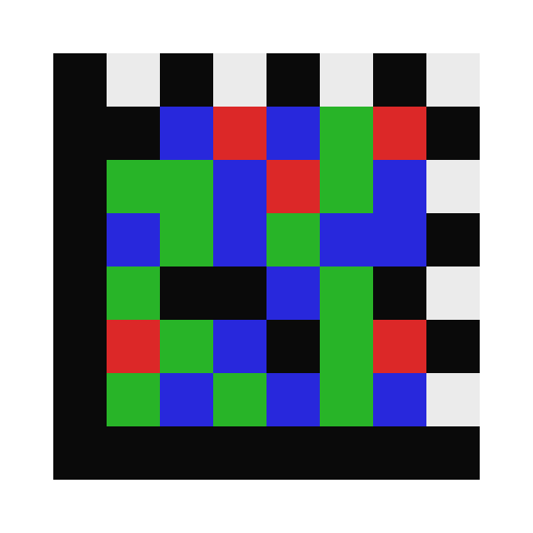

# ChessMatrix

[](https://www.npmjs.com/package/chessmatrix)
[](https://pypi.org/project/chessmatrix/)
[](https://hacker6284.github.io/ChessMatrix/)
[](LICENSE)

**A 4-color 8×8 2D barcode format.**

ChessMatrix is a compact, machine-readable 2D barcode that fits in an 8×8 cell grid — the same footprint as a chessboard — by using four colors (black, red, green, blue) instead of the traditional two, yielding 2 bits of information per cell. It is designed as a minimal, scannable symbol for applications where even the smallest standard formats (DataMatrix 10×10, Micro QR 11×11) are too large.

<p align="center">
  
</p>

## Installation

**Python**
```bash
pip install chessmatrix
# render_image() also requires Pillow:
pip install "chessmatrix[render]"
```

**JavaScript / Node.js**
```bash
npm install chessmatrix
```

**Browser (no bundler)**
```html
<script type="module">
  import { buildGrid, renderGrid } from 'https://cdn.jsdelivr.net/npm/chessmatrix/chessmatrix.js';
</script>
```

---

## 1. Motivation

The smallest standard 2D barcodes — DataMatrix 10×10 and Micro QR Version 1 (11×11) — cannot physically fit in an 8×8 cell footprint. ChessMatrix fills this gap by encoding 2 bits per cell via color rather than 1 bit per cell via luminance, achieving a useful payload within the 8×8 constraint.

**Net payload: 4 bytes (32 bits) per symbol**, protected by Reed-Solomon error correction.

---

## 2. Symbol Structure

The symbol is an 8×8 grid of colored cells, each one of:

| Symbol | Value | RGB (recommended) |
|--------|-------|-------------------|
| BLACK  | `0b00` | `#0A0A0A`        |
| RED    | `0b01` | `#DC2828`        |
| GREEN  | `0b10` | `#28B428`        |
| BLUE   | `0b11` | `#2828DC`        |

### 2.1 Grid Zones

```
Col:  0    1    2    3    4    5    6    7
     ┌────┬────┬────┬────┬────┬────┬────┬────┐
R0   │ T  │ t  │ T  │ t  │ T  │ t  │ T  │ t  │  ← Top timing (alternating K/W)
     ├────┼────┼────┼────┼────┼────┼────┼────┤
R1   │ F  │[K] │ D  │ D  │ D  │ D  │[R] │ tm │  ← [K] = BLACK anchor
     ├────┼────┼────┼────┼────┼────┼────┼────┤
R2   │ F  │ D  │ D  │ D  │ D  │ D  │ D  │ tm │
     ├────┼────┼────┼────┼────┼────┼────┼────┤
R3   │ F  │ D  │ D  │ D  │ D  │ D  │ D  │ tm │
     ├────┼────┼────┼────┼────┼────┼────┼────┤
R4   │ F  │ D  │ D  │ D  │ D  │ D  │ D  │ tm │
     ├────┼────┼────┼────┼────┼────┼────┼────┤
R5   │ F  │ D  │ D  │ D  │ D  │ D  │ D  │ tm │
     ├────┼────┼────┼────┼────┼────┼────┼────┤
R6   │ F  │[G] │ D  │ D  │ D  │ D  │[B] │ tm │  ← [G] = GREEN anchor, [B] = BLUE anchor
     ├────┼────┼────┼────┼────┼────┼────┼────┤
R7   │ F  │ F  │ F  │ F  │ F  │ F  │ F  │ F  │  ← Bottom finder (all BLACK)
     └────┴────┴────┴────┴────┴────┴────┴────┘

F  = Finder bar (BLACK)
T/t = Timing cell (T=BLACK, t=WHITE, alternating)
tm = Right timing column (alternating K/W, row0=WHITE, row1=BLACK, ...)
[K][R][G][B] = Color calibration anchors
D  = Data cell (2-bit color-encoded)
```

### 2.2 Border Cells (28 cells)

**Left finder bar** — column 0, rows 0–7: all **BLACK**

**Bottom finder bar** — row 7, cols 0–7: all **BLACK**

**Top timing strip** — row 0, cols 0–7:
- Even columns (0, 2, 4, 6): **BLACK**
- Odd columns (1, 3, 5, 7): **WHITE**

**Right timing strip** — col 7, rows 0–7:
- Even rows (0, 2, 4, 6): **WHITE**
- Odd rows (1, 3, 5, 7): **BLACK**

The timing strips continue to alternate even at their shared corners: (0,7) is WHITE (even column dominates in top timing; right timing confirms even row → WHITE).

### 2.3 Color Calibration Anchors (4 cells)

Located at the four corners of the 6×6 interior:

| Position | Color  | Purpose                          |
|----------|--------|----------------------------------|
| (row=1, col=1) | **BLACK** | Dark reference |
| (row=1, col=6) | **RED**   | Red channel reference |
| (row=6, col=1) | **GREEN** | Green channel reference |
| (row=6, col=6) | **BLUE**  | Blue channel reference |

A decoder samples these four cells first to calibrate its color discrimination thresholds before decoding any data cells. This compensates for lighting color temperature, ink variation, and camera white-balance errors.

### 2.4 Data Cells (32 cells)

The remaining interior cells, read in row-major order (top to bottom, left to right), skipping the four anchors:

```
Row 1: (1,2) (1,3) (1,4) (1,5)                          — 4 cells
Row 2: (2,1) (2,2) (2,3) (2,4) (2,5) (2,6)              — 6 cells
Row 3: (3,1) (3,2) (3,3) (3,4) (3,5) (3,6)              — 6 cells
Row 4: (4,1) (4,2) (4,3) (4,4) (4,5) (4,6)              — 6 cells
Row 5: (5,1) (5,2) (5,3) (5,4) (5,5) (5,6)              — 6 cells
Row 6:        (6,2) (6,3) (6,4) (6,5)                   — 4 cells
                                                  TOTAL  = 32 cells
```

---

## 3. Data Encoding

### 3.1 Color-to-Bit Mapping

Each cell encodes exactly 2 bits:

```
BLACK = 0b00 = 0
RED   = 0b01 = 1
GREEN = 0b10 = 2
BLUE  = 0b11 = 3
```

### 3.2 Bit Packing

32 cells × 2 bits = **64 bits = 8 bytes** raw capacity.

Cells are packed MSB-first, 4 cells per byte:

```
Byte 0: cells[0] bits[7:6] | cells[1] bits[5:4] | cells[2] bits[3:2] | cells[3] bits[1:0]
Byte 1: cells[4] bits[7:6] | cells[5] bits[5:4] | cells[6] bits[3:2] | cells[7] bits[1:0]
...
Byte 7: cells[28]...cells[31]
```

To decode byte `b` from cells `4b`, `4b+1`, `4b+2`, `4b+3`:
```
byte_val = (color[4b] << 6) | (color[4b+1] << 4) | (color[4b+2] << 2) | color[4b+3]
```

---

## 4. Reed-Solomon Error Correction

ChessMatrix uses a **RS(8, 4)** code over GF(2⁸):

| Parameter | Value |
|-----------|-------|
| Total codeword length | 8 symbols (bytes) |
| Data symbols | 4 bytes |
| Parity symbols | 4 bytes |
| Maximum correctable errors | **2 symbol errors** |
| Maximum detectable errors | 4 symbol errors |
| Primitive polynomial | x⁸ + x⁴ + x³ + x² + 1 (`0x11D`) |
| Generator roots | α⁰, α¹, α², α³ (where α = 2) |

The 4 data bytes occupy the **first 4 bytes** of the codeword; the 4 parity bytes occupy bytes 5–8. The codeword is stored across the 32 data cells in byte order (data bytes first, then parity bytes).

### 4.1 Error Budget Rationale

Color discrimination under real-world conditions is less reliable than luminance discrimination. A dirty scan, off-angle lighting, or color-shifted camera can misread an entire cell. Allocating 50% of capacity to error correction (vs. ~25% in standard DataMatrix 10×10) reflects this elevated error rate. RS(8,4) can correct any 2 completely wrong cells, which covers most single-color-channel failures.

---

## 5. Encoding Algorithm

1. **Validate input**: data must be exactly 4 bytes.
2. **RS encode**: compute 4 parity bytes via polynomial long division over GF(2⁸), producing an 8-byte codeword `[d0, d1, d2, d3, p0, p1, p2, p3]`.
3. **Pack into cells**: convert the 8 bytes to 32 dibits (2-bit values), one per data cell.
4. **Build grid**: initialize the 8×8 grid with the border pattern (finder + timing) and calibration anchors, then write the 32 data cells.

---

## 6. Decoding Algorithm

1. **Locate symbol**: find the L-shaped finder corner (bottom-left) and orientation markers.
2. **Rectify geometry**: use the finder bars and timing strips to establish the module grid (perspective correction, skew correction).
3. **Calibrate colors**: sample the four anchor cells at (1,1), (1,6), (6,1), (6,6) to build color classification thresholds for this scan.
4. **Classify cells**: for each of the 32 data cells, classify the sampled color as BLACK/RED/GREEN/BLUE using the calibrated thresholds.
5. **Unpack bytes**: convert the 32 dibits back to 8 bytes.
6. **RS decode**: compute syndromes. If nonzero, apply Berlekamp-Massey + Chien search + Forney algorithm to locate and correct up to 2 symbol errors.
7. **Return payload**: the first 4 bytes of the corrected codeword are the user data.

### 6.1 Color Calibration Detail

The decoder builds a calibration matrix from the four anchors:

```python
reference = {
    BLACK: sample(1, 1),   # known-black pixel
    RED:   sample(1, 6),   # known-red pixel
    GREEN: sample(6, 1),   # known-green pixel
    BLUE:  sample(6, 6),   # known-blue pixel
}
```

Each unknown cell is classified to the nearest anchor in RGB color space (Euclidean distance, or a simplified channel-dominance heuristic). This makes the format robust to uniform color shifts (e.g., tungsten lighting making everything yellowish).

---

## 7. Constraints and Limitations

- **Payload**: 4 bytes (32 bits). Sufficient for a serial number, short ID, timestamp, or small integer.
- **Color printing required**: cannot be produced on a monochrome printer.
- **Scanner requirements**: color camera or color sensor; standard laser barcode scanners cannot read ChessMatrix.
- **Print resolution**: each cell must be large enough to be unambiguously colored (~0.5mm minimum per cell in practice, so minimum symbol size ~4mm × 4mm).
- **No rotation invariance built in**: the finder pattern establishes a single canonical orientation. A 180° rotated symbol will fail to decode. (A future extension could add a rotation indicator cell.)

---

## 8. Python Implementation

Install: `pip install chessmatrix`  (add `[render]` extra for PNG output)

```python
from chessmatrix import encode, decode, render_image, render_ascii

data = b'\xDE\xAD\xBE\xEF'
grid = encode(data)          # List[List[int]], 8×8, values 0-3 or -1
render_ascii(grid)           # colored output in terminal
render_image(grid, 'code.png', cell_size=60)   # requires Pillow

recovered = decode(grid)
assert recovered == data
```

**API**

| Function | Description |
|---|---|
| `encode(data: bytes) -> Grid` | Encode 4 bytes → 8×8 color grid |
| `decode(grid: Grid) -> bytes` | Decode grid → 4 bytes (RS error correction applied) |
| `render_image(grid, path, cell_size=40)` | Save PNG (requires Pillow) |
| `render_ascii(grid)` | Print colored ASCII art to terminal |
| `CorrectionError` | Raised when RS decoding cannot correct errors |

`Grid` is `List[List[int]]` — an 8×8 nested list of color values (0–3, or -1 for white structural cells).

---

## 9. JavaScript Implementation

Install: `npm install chessmatrix`

```javascript
import { lettersToBytes, buildGrid, renderGrid } from 'chessmatrix';

// Encode 4 bytes onto a canvas
const bytes = new Uint8Array([0xDE, 0xAD, 0xBE, 0xEF]);
const grid  = buildGrid(bytes);
renderGrid(grid, document.getElementById('canvas'), 40);  // 40px per cell
```

```javascript
import { bytesToLetters, lettersToBytes, buildGrid } from 'chessmatrix';

// 6-letter convenience codec (5-bit packing, A=0…Z=25)
const bytes   = lettersToBytes('HELLO!'.replace(/[^A-Z]/gi, 'A'));  // Uint8Array(4)
const letters = bytesToLetters(bytes);   // → 'HELLOA'
```

```javascript
import { ChessMatrixScanner } from 'chessmatrix';

// Camera scanner (browser only — requires getUserMedia)
const scanner = new ChessMatrixScanner({
  videoEl:  document.getElementById('video'),
  canvasEl: document.getElementById('canvas'),
  onDecode: (letters) => console.log('Scanned:', letters),
  onStatus: (msg, state) => console.log(state, msg),
});
await scanner.start();
```

**API**

| Export | Description |
|---|---|
| `buildGrid(bytes: Uint8Array) → Int8Array` | Encode 4 bytes → 64-cell flat grid (row-major) |
| `renderGrid(grid, canvas, cellSize?)` | Draw grid on an HTMLCanvasElement |
| `lettersToBytes(str) → Uint8Array` | 6-letter string → 4 bytes (5-bit packing) |
| `bytesToLetters(bytes) → string` | 4 bytes → 6-letter string |
| `ChessMatrixScanner` | Semi-guided camera scanner class (browser only) |
| `CorrectionError` | Thrown when RS decoding cannot correct errors |
| `DATA_CELLS` | `[row, col][]` — the 32 data cell positions in read order |

> `renderGrid` and `ChessMatrixScanner` require a browser environment (Canvas API / `getUserMedia`). The codec functions (`buildGrid`, `lettersToBytes`, etc.) are pure JavaScript and work in Node.js.

**Browser (CDN, no bundler)**
```html
<script type="module">
  import { buildGrid, renderGrid } from
    'https://cdn.jsdelivr.net/npm/chessmatrix/chessmatrix.js';
</script>
```

---

## 10. License

ChessMatrix is an open specification. Implement freely.
